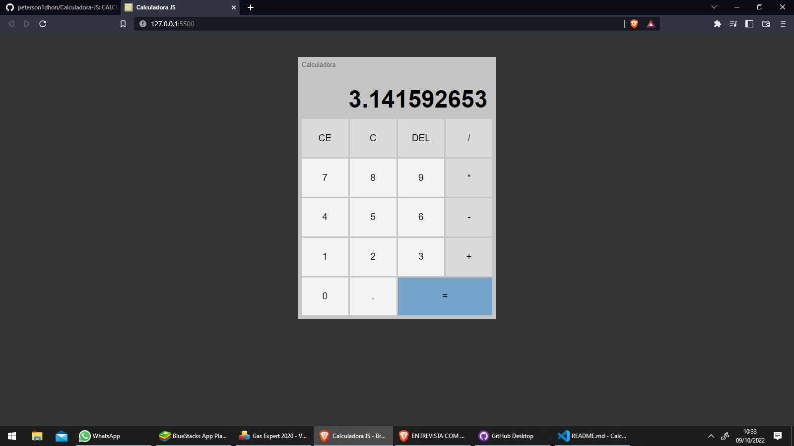

# Calculadora-JS
 

> CALCULADORA JS 

Projeto construído do tutorial em video HORA DE CODAR, (com modificações).

[🔗 Clique aqui para acessar gitHub](https://github.com/peterson1dhon/Calculadora-JS)

[🔗 Clique aqui para acessar site no ar](https://calculadorajs-6ebd5.web.app/)

## 🛠 Tecnologias

- HTML 5
- CSS 3
- JAVASCRIPT
- Git e Github

## 💛 Contato

peterson.br94@gmail.com
